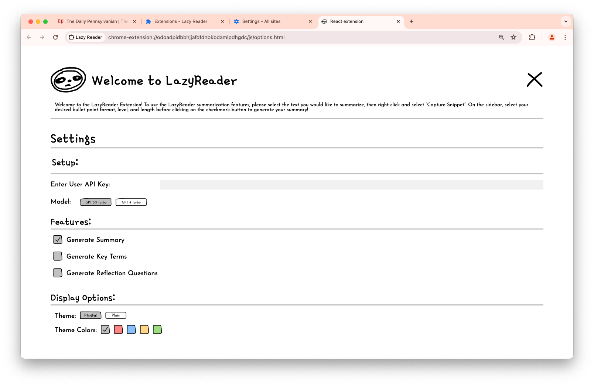
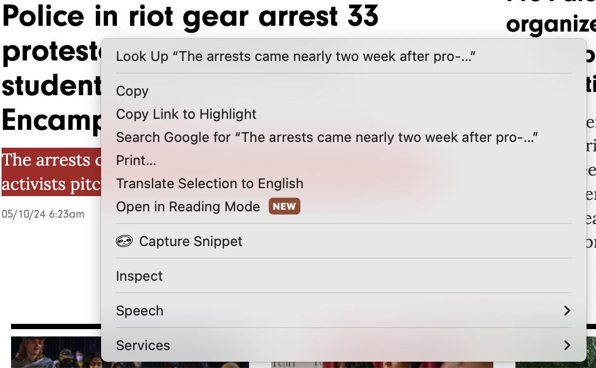
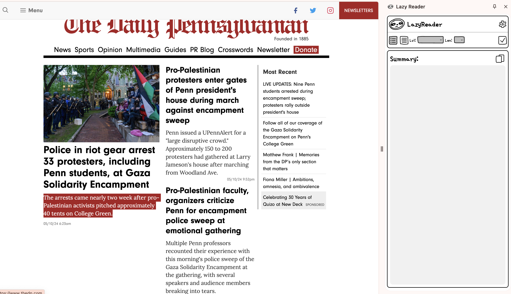

# Lazy-Reader
<p align="center">
  
</p>

This repo contains the final project for the University of Pennsylvania CIS 3500 Spring 2024 course for Team 6. The team consists of [Annie Wang](https://github.com/anniewangre), [Emma Lee](https://github.com/emmrlee), [Kevin Lee](https://github.com/kleekev), & [Rohan Kamat](https://github.com/kamatro1).

In this project, we built a **Chrome extension** using [React](https://react.dev/) with TypeScript and Webpack. It showcases key features such as interacting with Chrome APIs ([storage](https://developer.chrome.com/docs/extensions/reference/api/storage), [contextMenus](https://developer.chrome.com/docs/extensions/reference/api/contextMenus), [sidePanel](https://developer.chrome.com/docs/extensions/reference/api/sidePanel)) and the [OpenAI API](https://platform.openai.com/docs/introduction).

A "landing page" showcasing the extension can be found [here](https://anniewangre.github.io/LazyReader-Landing-Page/).

## Features

- 📝 Text Summarization
- 🔍 Key Term Extraction & Definitions
- ❓ Reflection Question Generation
- 💻 Customizable UI (both style and color)
- 🖊️ Flexible Responses (length, format, complexity)

A "promo video" demonstrating the extension's features can be found [here](https://youtu.be/7Qtkc-lb2-M).

## Screenshots

The first screenshot showcases the **Settings Page** where the user enters their API key, chooses the response type(s), and customizes their UI:

The second screenshot showcases the **Context Menu** that appears when the user right-clicks on the highlighted text they wish to use for the response:

The third screenshot showcases the **Side Panel** where the user customizes the response (bullet point or paragraph format, length, complexity), and where the response is presented:


## Installation from Source

0. In the terminal, naviagte to the folder where you'd like to install the extension (e.g., ```cd Desktop```).

1. Clone the repository:

    ```bash
   git clone https://github.com/kamatro1/Lazy-Reader.git
   ```

3. Install dependencies:

   ```bash
   cd chrome-extension-text-collector
   npm install
   ```

4. Build the extension:

   ```bash
   npm run build
   ```

5. Load the extension in Chrome:

   - Open Chrome and navigate to `chrome://extensions`
   - Enable "Developer mode"
   - Click "Load unpacked" and select the `dist` directory from the project

## Usage Instructions

Once you load the extension in Chrome (see *Step 4* of *Installation from Source* above), you'll be automatically directed to the *Settings Page*.

### Settings Page

#### Setup

- Enter your [OpenAI API key](https://platform.openai.com/docs/quickstart).
- Choose the OpenAI model used to generate the responses, between ```GPT 3.5 Turbo``` and ```GPT 4 Turbo```. Note that your access to the ```GPT 4 Turbo``` depends on your [OpenAI usage tier](https://platform.openai.com/docs/guides/rate-limits/usage-tiers). 

#### Features

- Choose which features you'd like included in your response out of *Generate Summary*, *Generate Key Terms*, & *Generate Reflection Questions*.

#### Display Options

- Choose the theme for the *Side Panel* between *Playful* or *Plain*.
- Choose the theme color for the *Side Panel* between *Grey, Red, Blue, Yellow*, or *Green*.

**Once you have made your selections, be sure to exit the *Settings Page* by clicking the cross in the top right of the page to save your settings!**

### Context Menu

Once you have saved your settings on the *Settings Page*, you may select the text to be used for your response.

- Highlight the text you wish to be used for your response.
- Right-click on the selected text resulting in a *Context Menu* appearing.
- Select *Capture Snippet* from the *Context Menu* (the one with the sloth face next to it, our logo!)

### Side Panel

Once you have saved your settings on the *Settings Page*, and selected the web page text using the *Context Menu*, you can generate your response using the *Side Panel*.

- Open the *Side Panel* using the extension button in the top right of the Chrome window.
- Choose between *Bullet Point* or *Paragraph* format using the two icons.
- Choose the complexity of the response using the *Lvl* drop down menu between *Beginner, Intermediate*, or *Advanced*.
- Choose the length of the response using the *Len* drop down menu between *S(mall), M(edium)*, or *L(arge)*.
- Click the tick icon on the right to save your selections and generate a response.
- Copy the response using the overlayed rectangles on the right.
- If you change any settings, or select new text, hit the "Regenerate" button where the tick icon was to generate a new response.

## Reporting Issues

Please feel free to make any comments regarding suggestions, bugs, improvements, or new features in the issues section of the repository!

## Credits

The initial setup of this project was based on Professor Lumbroso's [Chrome Extension Starter](https://github.com/CIS-3500/chrome-extension-react-typescript-starter/tree/main) repo. Furthermore, parts of this ```ReadMe.md``` file have been taken from the same repo's ReadMe. 

## License

This project is licensed under the terms of the MIT license.
